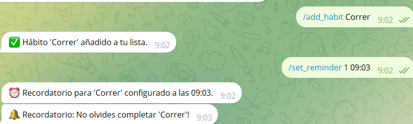

# Documentación del proyecto: bot de hábitos

## Portada

**Bot para el control de hábitos**  
Propietario: **Manuel Conde Moreno**

---

## Índice

1. [Introducción](#1-introducción)
2. [Objetivo del Proyecto](#2-objetivo-del-proyecto)
3. [Tecnologías Utilizadas](#3-tecnologías-utilizadas)
4. [Descripción del Proyecto](#4-descripción-del-proyecto)
5. [Estructura del Código](#5-estructura-del-código)
6. [Funcionalidades Implementadas](#6-funcionalidades-implementadas)
7. [Resultados Obtenidos](#7-resultados-obtenidos)
8. [Conclusiones](#8-conclusiones)
9. [Bibliografía](#9-bibliografía)

---

## 1. Introducción

El proyecto consiste en el desarrollo de un bot de Telegram diseñado para ayudar a los usuarios a gestionar sus hábitos diarios de forma sencilla y eficaz. Este bot permite:

- Registrar hábitos
- Visualizarlos
- Eliminarlos
- Marcarlos como completados
- Recibir recordatorios

En un mundo cada vez más conectado, donde las personas buscan optimizar su tiempo y mejorar su productividad, el bot de hábitos se convierte en una herramienta práctica y accesible para fomentar la organización personal.

---

## 2. Objetivo del proyecto

El objetivo principal del bot es proporcionar una solución tecnológica que permita a los usuarios:

- **Registrar** hábitos que deseen mantener o mejorar.
- **Visualizar** su progreso en tiempo real.
- **Eliminar** hábitos que ya no sean relevantes.
- **Recibir recordatorios** diarios para completar sus hábitos a la hora establecida.

---

## 3. Tecnologías utilizadas

El desarrollo del bot utiliza las siguientes tecnologías y herramientas:

- **Lenguaje de programación:** Python
- **Librerías:**
  - `python-telegram-bot`: Para interactuar con la API de Telegram.
  - `apscheduler`: Para gestionar recordatorios y tareas programadas.
  - `logging`: Para depuración y registro de eventos.

---

## 4. Descripción del proyecto

El bot se ejecuta en Telegram y permite la interacción mediante comandos específicos. Los usuarios pueden añadir, modificar y eliminar hábitos, además de configurar recordatorios personalizados. 
El bot almacena los datos temporalmente en memoria (`user_habits`), pero está diseñado para facilitar futuras extensiones como almacenamiento en bases de datos.

---

## 5. Estructura del código

### **Configuración inicial**
- Importación de librerías y configuración de `logging`.

### **Variables globales**
- `user_habits`: Diccionario para almacenar los hábitos de cada usuario.

### **Definición de comandos**

- `/start`: Presenta el bot y sus funcionalidades.
- `/add_habit`: Permite agregar un nuevo hábito.
- `/list_habits`: Muestra todos los hábitos del usuario.
- `/delete_habit`: Elimina un hábito específico.
- `/complete_habit`: Marca un hábito como completado.
- `/set_reminder`: Configura un recordatorio diario para un hábito.

### **Planificación de recordatorios**
- Uso de `apscheduler` para gestionar tareas programadas.

### **Función principal**
- Inicializa el bot y gestiona la escucha de comandos mediante `run_polling()`.

---

## 6. Funcionalidades implementadas

### **Comandos disponibles**

- **`/start`**: Presenta al usuario las instrucciones básicas del bot.
- **`/add_habit [hábito]`**: Permite añadir un nuevo hábito.
  - Ejemplo: `/add_habit correr`.
- **`/list_habits`**: Muestra todos los hábitos registrados.
- **`/delete_habit [número]`**: Elimina un hábito por número.
  - Ejemplo: `/delete_habit 1` elimina el primer hábito.
- **`/complete_habit [número]`**: Marca un hábito como completado.
- **`/set_reminder [número] [hora]`**: Configura un recordatorio diario.
  - Ejemplo: `/set_reminder 1 09:23` programa un recordatorio para el primer hábito a las 09:23.

### **Notificaciones**
- El bot envía notificaciones automáticas diarias según lo configurado.

---

## 7. Resultados obtenidos

El bot cumple con los siguientes objetivos:

- Permite gestionar hábitos de forma personalizada.
- Facilita la organización mediante recordatorios diarios.
- Ofrece una interfaz simple e intuitiva con comandos de Telegram.
- Proporciona una base para futuras mejoras como integración con bases de datos.

---

## 8. Conclusiones

El bot de hábitos es una herramienta efectiva para la gestión y cumplimiento de metas diarias. Su implementación destaca por:

- Adaptabilidad a las necesidades del usuario.
- Flexibilidad para futuras ampliaciones tecnológicas.
- Aplicación de conceptos clave de programación y manejo de datos.

---

## 9. Bibliografía

- [Documentación oficial de python-telegram-bot](https://docs.python-telegram-bot.org/)
- [Guía de uso de apscheduler](https://apscheduler.readthedocs.io/)
- [Recursos de aprendizaje de Python](https://docs.python.org/3/tutorial/index.html)
- [API de Telegram](https://core.telegram.org/bots/api)
- [ChatGPT](https://chatgpt.com/)
- [AsyncAPI](https://www.asyncapi.com/docs)
- [Repositorio del Proyecto (GitHub)](https://github.com/ManuelCM-cell/BotHabitos)
## Tabla de comandos y funcionalidades

---

| Comando | Descripción |
|---------|------------|
| `/start` | Muestra información inicial sobre el bot. |
| `/add_habit [hábito]` | Añade un nuevo hábito. |
| `/list_habits` | Lista los hábitos registrados. |
| `/delete_habit [número]` | Elimina un hábito según su número. |
| `/complete_habit [número]` | Marca un hábito como completado. |
| `/set_reminder [número] [hora]` | Configura un recordatorio diario. |
| `/progress_report` | Muestra un informe del progreso del usuario. |

| Comando | Imagen |
|---------|--------|
| **/start** |  |
| **/add_habit** |  |
| **/delete_habit** |  |
| **/list_habits** |  |
| **/progress_report** |  |
| **/set_reminder** |  |
| **Lista de hábitos guardados** |  |

---

## Actualización memoria (2º Trimestre)

### **Mejoras implementadas**

- **Sistema de almacenamiento:** Se solucionó la pérdida de datos al cerrar el bot implementando un archivo JSON.
- **Corrección de errores en `apscheduler`**: Se utilizó `asyncio` para asegurar la correcta ejecución de `send_reminder`.
- **Verificación de zona horaria**: Se ajustó `apscheduler` para adaptarse a la zona horaria del usuario (Madrid).
- **Validación de entradas**: Se añadieron verificaciones para evitar fallos al ingresar datos incorrectos.

### **Nuevas funcionalidades**

- **Comando `/progress_report`**: Genera un reporte del progreso basado en hábitos completados.
- **Mejoras en manejo de errores**: Validaciones para evitar comandos inválidos.

### **Mejoras futuras**

- Edición de hábitos (nombre y descripción).
- Gráfico mejorado para visualizar progreso.
- Implementación de base de datos en lugar de JSON.

---

## Actualización memoria (tercer trimestre)

## Integración con MongoDB
- Se sustituyó el almacenamiento local en JSON por MongoDB Atlas.
- Se creó una colección `habits` en la base de datos `habits_db`.
- Se agregaron funciones `get_user_habits` y `save_user_habits` para interactuar con la base de datos.

## Configuración con Variables de Entorno
- Se creó un archivo `config.py` que utiliza `os.getenv()` para obtener el token del bot y la URI de MongoDB desde variables de entorno.
- Se agregó el archivo `ejecucion.env` para definir estas variables de entorno.

## Dockerización del Proyecto
- Se creó un `Dockerfile` para ejecutar el bot en un contenedor.
- Se construyó la imagen con `docker build -t habitbot .`
- Se ejecuta con `docker run --env-file ejecucion.env habitbot`
